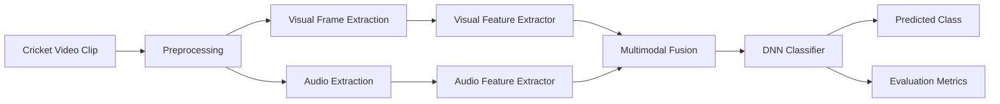

# Audio-Visual Action Recognition using Cricket Dataset

This project implements a multimodal deep learning system for recognizing key cricket actions from video clips by combining visual and audio information. The system classifies each clip into one of four cricket event categories:

- Four Runs
- Six Runs
- Wicket
- Others

The project uses pretrained visual and audio feature extractors, evaluates multiple fusion strategies, and identifies attention-based audio-visual fusion as the most practical and robust approach for cricket event classification.

## Overview

Cricket broadcast videos are difficult to classify using only visual information because events such as fours and sixes can look visually similar. Camera motion, occlusion, crowd scenes, replay cuts, and changing viewpoints further increase ambiguity.

To address this, the system uses both:

- Visual cues such as player motion, shot patterns, and frame-level context
- Audio cues such as crowd reaction, commentary intensity, and bat-ball impact sounds

By combining these modalities, the model improves recognition of visually similar cricket events and produces more balanced class-wise performance.

## Objectives

- Extract discriminative audio features using YAMNet, VGGish, CLAP, and MFCC.
- Extract spatial and spatiotemporal visual features using ResNet18, R3D-18, and C3D.
- Compare early fusion, late fusion, gated fusion, and attention-based fusion.
- Train a DNN classifier for four-class cricket action recognition.
- Evaluate performance using accuracy, precision, recall, F1-score, and confusion matrices.

## Dataset

A custom cricket action dataset was created from publicly available cricket videos.

Dataset details:

- Source: YouTube cricket videos
- Classes: Four Runs, Six Runs, Wicket, Others
- Samples: 350 video clips per class
- Total clips: 1400
- Split ratio: 80% training, 10% validation, 10% testing
- Annotation fields: video ID, event label, start time, end time, and clip duration

Each annotated event was clipped from the source video and stored in a class-specific folder. This produced a balanced dataset for supervised multimodal learning.

## System Architecture



The pipeline is divided into four main modules:

- Data Processing Module: loads, labels, shuffles, splits, and validates the dataset.
- Feature Extraction Module: extracts visual and audio embeddings from each clip.
- Fusion and Classification Module: combines modalities and predicts the action class.
- Evaluation Module: generates accuracy scores, classification reports, and confusion matrices.

## Feature Extraction

### Visual Features

Visual features are extracted from video frames using pretrained deep learning models:

- ResNet18: frame-level spatial feature extraction
- R3D-18: spatiotemporal video representation
- C3D: short-term motion and temporal pattern learning

For the selected attention-fusion model, ResNet18 produces 512-dimensional visual embeddings. Frames are sampled, resized to 224 x 224, converted to RGB, normalized, and temporally pooled.

### Audio Features

Audio features are extracted using pretrained and handcrafted audio models:

- YAMNet: semantic audio event embeddings
- VGGish: deep audio feature representation
- CLAP: cross-modal audio embedding
- MFCC: low-level spectral representation

For the selected attention-fusion model, YAMNet produces 1024-dimensional audio embeddings. Audio is sampled at 16 kHz and converted internally into log-mel spectrogram-based representations.

## Fusion Strategies

The project evaluates four fusion strategies:

- Early Fusion: concatenates audio and visual features before classification.
- Late Fusion: combines prediction scores from independently trained audio and visual models.
- Gated Fusion: learns dynamic modality weights through trainable gates.
- Attention-Based Fusion: adaptively emphasizes the most informative audio or visual cues for each clip.

The attention-based approach fuses the 512-D visual embedding and 1024-D audio embedding into a 1536-D multimodal representation, which is passed into a DNN classifier.

## Model Training

The classifier is a multilayer perceptron trained on fused audio-visual features.

Training configuration:

- Framework: PyTorch
- Optimizer: Adam
- Classifier: DNN / MLP with ReLU activations
- Output layer: Softmax for four-class classification
- Validation strategy: stratified train-validation-test split
- Overfitting control: early stopping

## Results

The best practical model selected in the report is:

```text
Visual model: ResNet18
Audio model: YAMNet
Fusion: Attention-based fusion
Accuracy: approximately 86%
```

This model achieved balanced class-wise performance and showed strong robustness across all four cricket action categories.

Classification report for ResNet18 + YAMNet with attention fusion:

| Class | Precision | Recall | F1-score |
| --- | ---: | ---: | ---: |
| Four Runs | 0.86 | 0.89 | 0.87 |
| Six Runs | 0.90 | 0.87 | 0.88 |
| Wicket | 0.79 | 0.78 | 0.79 |
| Others | 0.89 | 0.91 | 0.90 |

Fusion comparison:

| Visual Model | Audio Model | Early Fusion | Late Fusion | Gated Fusion | Attention Fusion |
| --- | --- | ---: | ---: | ---: | ---: |
| ResNet18 | YAMNet | 0.788 | 0.850 | 0.860 | 0.860 |
| R3D-18 | MFCC | 0.790 | 0.740 | 0.770 | 0.770 |
| ResNet18 | VGGish | 0.760 | 0.760 | 0.780 | 0.800 |
| C3D | CLAP | 0.837 | 0.873 | 0.860 | 0.800 |
| C3D | MFCC | 0.550 | 0.760 | 0.750 | 0.770 |

Although C3D + CLAP with late fusion achieved the highest raw accuracy of 87.3%, ResNet18 + YAMNet with attention fusion was selected as the most suitable model because it provided a better balance of accuracy, class-wise consistency, robustness, and interpretability.

## Testing

The system was tested across the complete pipeline:

- Dataset CSV loading
- Video clipping using timestamps
- Visual frame extraction
- Audio extraction and resampling
- ResNet18 visual feature extraction
- YAMNet audio feature extraction
- Attention-based fusion
- DNN classifier training
- Inference on test videos
- Confusion matrix and classification report generation

Most test cases passed successfully. Failed cases were mainly caused by data quality issues such as silent audio tracks and corrupted video files.

## Applications

- Cricket match analytics
- Automated highlight generation
- Sports video indexing and retrieval
- Event detection from broadcast videos
- AI-based sports analysis research
- Multimodal learning experimentation

## Limitations

- The dataset is limited to four cricket action classes.
- Videos are collected from YouTube, so resolution, camera angle, lighting, and audio quality vary.
- Some annotations may contain minor timing inaccuracies.
- The system currently works on pre-recorded clips rather than live streams.
- Missing audio tracks or corrupted videos can affect feature extraction.

## Future Scope

- Extend the system for real-time cricket event detection.
- Add more cricket classes such as catches, wides, no-balls, and run-outs.
- Use larger sports datasets and full-match videos.
- Improve temporal modeling with long-term motion features.
- Experiment with multi-head attention for stronger multimodal fusion.
- Add event localization at the frame level.
- Deploy the model on edge devices or live streaming platforms.

## Academic Context

This work was developed as a fifth-semester mini project for the Bachelor of Engineering program in Computer Science and Engineering during the academic year 2025-2026.
